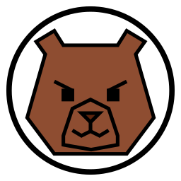
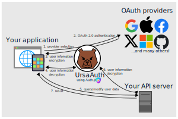

# UrsaAuth

<div align="center">
  
  <p><em>Kuma-chan</em></p>
</div>

UrsaAuth is an authentication server built on [Auth.js](https://authjs.dev/) core functions 🐻

Kuma-chan is saying... **it is now on development & experiment phase**.

## Features

<div align="center">
  
  <p><em>UrsaAuth description</em></p>
</div>

1. OAuth provider selections (Google, GitHub, X, ...)
2. User information encryption
3. **Web/Mobile universal authentication ← Main feature!!**

> [!NOTE]
> Auth.js saves an encrypted user information into browser's cookie, which is not suitable for mobile applications.
>
> UrsaAuth extends Auth.js to pass encrypted user information to Web/Mobile applications with PKCE flow.
>

# How to setup test environment
you can test UrsaAuth by running 3 servers in your local environemnt.
- UrsaAuth server
- Next.js server (UrsaAuth login)
- API server (use UrsaAuth protection)

## config
- `.ursa-auth.config.json` and `.env.development` for UrsaAuth server:
  - see `ursa-auth.config.schema.ts` for server config json structure
  - `CONFIG_PATH=.ursa-auth.config.json` or specify your customized config path in `.env.development`
- `.env.development` for example applications:
  - Next.js application in `example/next` use these environment variables
    - NEXT\_PUBLIC\_HOST\_URL: this Next.js application's URL
    - NEXT\_PUBLIC\_URSA\_AUTH\_URL: UrsaAuth server's URL
    - NEXT\_PUBLIC\_URSA\_AUTH\_PKCE\_NAME: temporal cookie name for UrsaAuth PKCE vode verifier
    - AUTH\_SESSION\_NAME: session cookie name for UrsaAuth
    >
    > - Normally Next.js does not expose environment variables to client side codes.
    >   it means, `process.env.YOUR_ENV_NAME` is `undefined` in client side codes
    > - Exceptionally, Next.js exposes environment variables start with `NEXT_PUBLIC_` to client side codes
    >   - dynamic way (`process.env['NEXT_PUBLIC_YOUR_ENV_VALUE']`) does not work. 
    >     We need to write down full `process.env.NEXT_PUBLIC_YOUR_ENV_VALUE` in sources, and Next.js seems to do some replacements with your value.
    >
    > https://nextjs.org/docs/app/guides/environment-variables
    >
    > `AUTH_SESSION_NAME` is intended to use in server side, others in client & server side.
    >
  - API server in `example/api-server` use this environment varible
    - URSA\_AUTH\_URL: UrsaAuth server's URL


In `nginx.conf` and `docker-compose.yml` these values are hard coded, which you might need to edit:
- NEXT\_PUBLIC\_HOST\_URL: `http://next.localhost`
- NEXT\_PUBLIC\_URSA\_AUTH\_URL: `http://auth.localhost`

## docker compose
you can start these servers by docker compose command.
```
docker compose up
```

